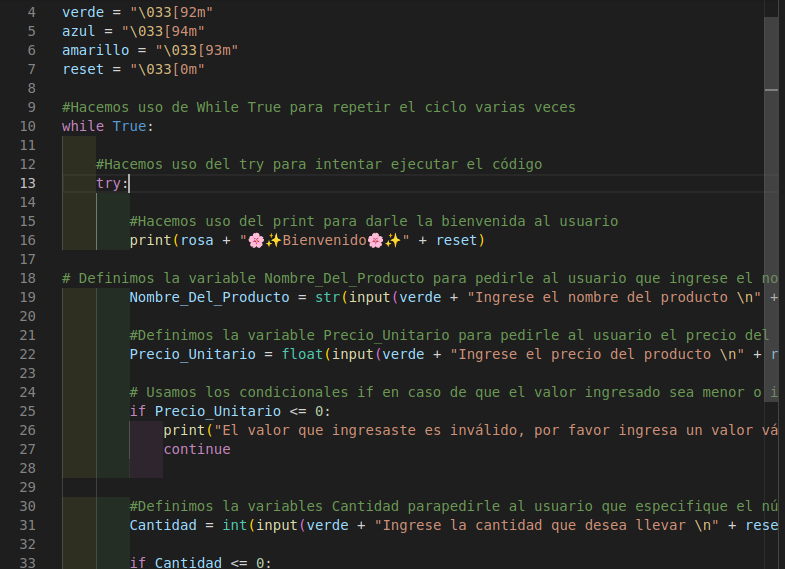

# **Historial_Usuario**

## **Descripción**

*Este programa tiene como función principal llevar un registro específico al momento de comprar un producto*

## **¿Cómo funciona?**

_El programa funciona siguendo un algoritmo, el cual consiste en:_

1. Le da la bienvenida al usuario
2. Le pide al usuario que ingrese el nombre del producto que quiere comprar
3. Le pide al usuario que ingrese el precio unitario del producto
4. Si el usuario ingresa un valor inválido, el programa le muestra un mensaje
pidiendóle que ingrese un valor válido
5. El programa le pide al usuario que digite qué cantidad desea llevar
6. En caso de que el usuario digite un valor inválido, le muestra un mensaje pidiendóle que ingrese un valor válido
7. Teniendo estos tres datos en cuenta, el programa calcula el total que el usuario debe pagar
8. Cuando ya el usuario sabe el valor que debe pagar, el programa le muestra el historial de la compra

